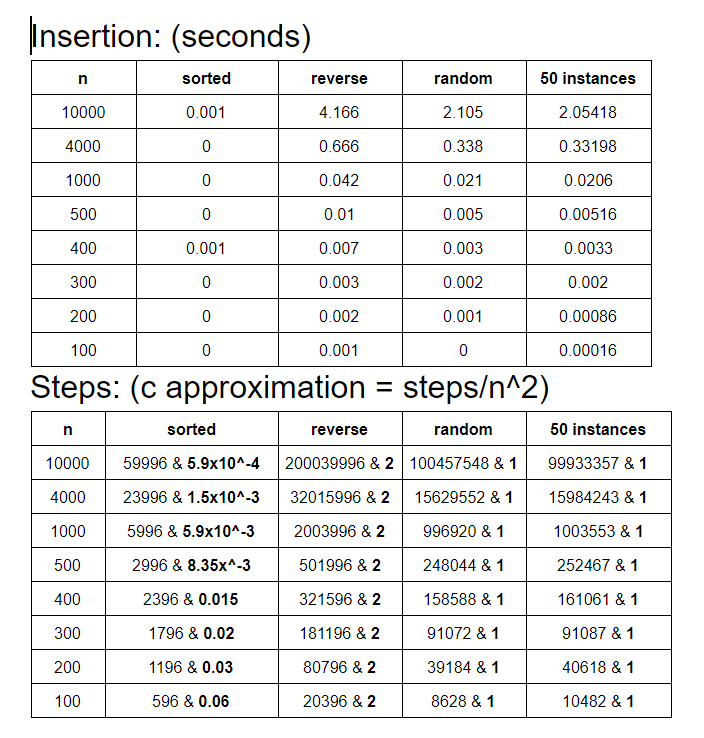
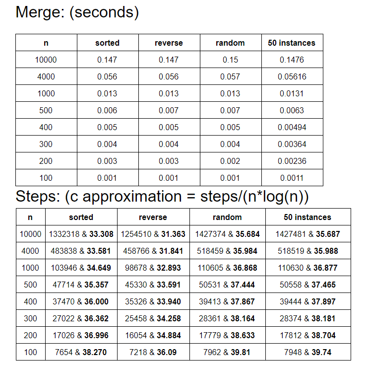

# Lab 1
The purpose of this lab is to compare the process time of insertion sort and merge sort.
# My results

#Things to note:
*Merge sort is way faster than insertion sort
*However, insertion sort is only faster than merge sort when the array is already sorted (more steps in merge sort)
*Merge sort takes less steps to sort in random permutation and reversely sorted
*Constant C for merge sort is way bigger than insertion sort
