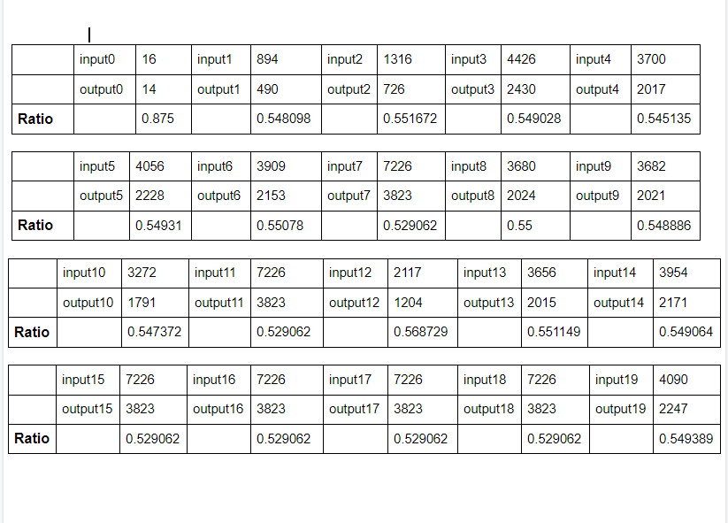

# Final Project Lab
## Text compression using Huffman Algorithm

Takes in an input file, encodes the characters into one binary string, compresses the file into an output file in the form of ASCII characters. The program then decompresses the output file back to binary string and then decodes to it's original form.

# Compression Ratio:

